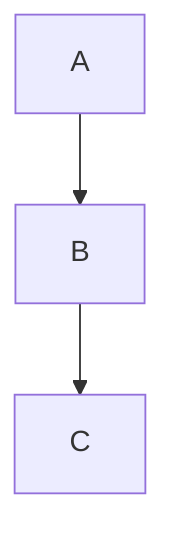
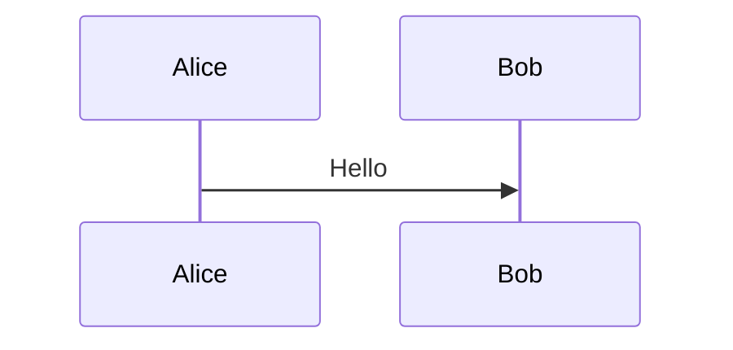

# Mermaid Server Implementation Plan

> **For Claude:** REQUIRED SUB-SKILL: Use superpowers:executing-plans to implement this plan task-by-task.

**Goal:** Create a Fastify HTTP server (`packages/mermaid-server/`) that wraps the mermaid library to expose parse, render, detect, extract, batch, and async job endpoints for external consumers, with a filesystem-based asset pipeline for input/output lifecycle management.

**Architecture:** JSDOM provides the browser-like environment mermaid needs for server-side rendering. An async mutex serializes access to mermaid's global config state. Playwright (optional) provides SVG-to-PNG rasterization via a headless Chromium page pool. A filesystem-based storage layer manages the asset lifecycle: `input → staged → processed → output → archive`.

**Tech Stack:** Fastify 5, JSDOM, mermaid (workspace), Playwright (optional), Vitest, @fastify/swagger

---

## Task 1: Package Scaffolding

**Files:**
- Create: `packages/mermaid-server/package.json`
- Create: `packages/mermaid-server/tsconfig.json`
- Create: `packages/mermaid-server/src/config.ts`

**Step 1: Create package.json**

```json
{
  "name": "@mermaid-js/mermaid-server",
  "version": "0.1.0",
  "private": true,
  "type": "module",
  "main": "src/index.ts",
  "scripts": {
    "dev": "tsx watch src/index.ts",
    "start": "tsx src/index.ts",
    "build": "tsc",
    "test": "vitest run",
    "test:watch": "vitest --watch"
  },
  "dependencies": {
    "mermaid": "workspace:*",
    "fastify": "^5.3.3",
    "@fastify/cors": "^11.0.0",
    "@fastify/swagger": "^9.6.0",
    "@fastify/swagger-ui": "^5.2.2",
    "jsdom": "^26.1.0"
  },
  "devDependencies": {
    "@types/jsdom": "^21.1.7",
    "typescript": "~5.8.0",
    "tsx": "^4.20.6",
    "vitest": "^3.2.4"
  }
}
```

**Step 2: Create tsconfig.json**

```json
{
  "extends": "../../tsconfig.json",
  "compilerOptions": {
    "outDir": "./dist",
    "rootDir": "./src",
    "declaration": true,
    "noEmit": false
  },
  "include": ["src/**/*.ts"],
  "exclude": ["dist", "node_modules", "test"]
}
```

**Step 3: Create server config module**

```typescript
// packages/mermaid-server/src/config.ts

export interface ServerConfig {
  port: number;
  host: string;
  logLevel: string;
  mermaid: {
    theme: string;
    securityLevel: string;
    maxTextSize: number;
  };
  png: {
    enabled: boolean;
    poolSize: number;
    timeout: number;
  };
  batch: {
    maxItems: number;
  };
}

export function loadConfig(): ServerConfig {
  return {
    port: parseInt(process.env.PORT ?? '3000', 10),
    host: process.env.HOST ?? '0.0.0.0',
    logLevel: process.env.LOG_LEVEL ?? 'info',
    mermaid: {
      theme: process.env.MERMAID_THEME ?? 'default',
      securityLevel: process.env.MERMAID_SECURITY_LEVEL ?? 'strict',
      maxTextSize: parseInt(process.env.MERMAID_MAX_TEXT_SIZE ?? '50000', 10),
    },
    png: {
      enabled: process.env.PNG_ENABLED !== 'false',
      poolSize: parseInt(process.env.PNG_POOL_SIZE ?? '4', 10),
      timeout: parseInt(process.env.PNG_TIMEOUT ?? '30000', 10),
    },
    batch: {
      maxItems: parseInt(process.env.BATCH_MAX_ITEMS ?? '50', 10),
    },
  };
}
```

**Step 4: Install dependencies**

Run: `cd /home/jgatlit/apps/mermaid/mermaid && pnpm install`

**Step 5: Verify pnpm resolves workspace dependency**

Run: `cd /home/jgatlit/apps/mermaid/mermaid && pnpm --filter @mermaid-js/mermaid-server list mermaid`
Expected: Shows mermaid linked from workspace

**Step 6: Commit**

```bash
git add packages/mermaid-server/
git commit -m "feat(server): scaffold mermaid-server package"
```

---

## Task 2: JSDOM Rendering Environment

**Files:**
- Create: `packages/mermaid-server/src/renderer/environment.ts`
- Create: `packages/mermaid-server/test/renderer/environment.test.ts`

**Reference:** `packages/mermaid/src/tests/util.ts:85-118` — the exact JSDOM patching pattern used by mermaid's own test suite.

**Step 1: Write failing test**

```typescript
// packages/mermaid-server/test/renderer/environment.test.ts
import { describe, it, expect } from 'vitest';
import { withEnvironment } from '../../src/renderer/environment.js';

describe('withEnvironment', () => {
  it('provides global window and document inside callback', async () => {
    let hadWindow = false;
    let hadDocument = false;

    await withEnvironment(async () => {
      hadWindow = typeof global.window !== 'undefined' && global.window !== null;
      hadDocument = typeof global.document !== 'undefined' && global.document !== null;
    });

    expect(hadWindow).toBe(true);
    expect(hadDocument).toBe(true);
  });

  it('restores globals after callback completes', async () => {
    const originalWindow = global.window;
    const originalDocument = global.document;

    await withEnvironment(async () => {
      // inside: globals are JSDOM
    });

    expect(global.window).toBe(originalWindow);
    expect(global.document).toBe(originalDocument);
  });

  it('restores globals even if callback throws', async () => {
    const originalWindow = global.window;

    await expect(
      withEnvironment(async () => {
        throw new Error('test error');
      })
    ).rejects.toThrow('test error');

    expect(global.window).toBe(originalWindow);
  });

  it('patches getBBox on SVG elements', async () => {
    await withEnvironment(async () => {
      const svg = global.document.createElementNS('http://www.w3.org/2000/svg', 'rect');
      const bbox = (svg as any).getBBox();
      expect(bbox).toHaveProperty('width');
      expect(bbox).toHaveProperty('height');
      expect(bbox.width).toBeGreaterThan(0);
    });
  });
});
```

**Step 2: Run test to verify it fails**

Run: `cd /home/jgatlit/apps/mermaid/mermaid && vitest run packages/mermaid-server/test/renderer/environment.test.ts`
Expected: FAIL — module not found

**Step 3: Implement environment.ts**

```typescript
// packages/mermaid-server/src/renderer/environment.ts
import { JSDOM } from 'jsdom';

const BASE_HTML = `
  <html lang="en">
    <body id="mermaid-server">
      <svg id="svg"/>
    </body>
  </html>
`;

const MOCKED_BBOX = { x: 0, y: 0, width: 100, height: 100 };

function setProperty(obj: any, key: string, value: unknown): void {
  obj[key] = value;
}

export async function withEnvironment<T>(fn: () => Promise<T>): Promise<T> {
  const oldWindow = global.window;
  const oldDocument = global.document;
  const oldMutationObserver = (global as any).MutationObserver;

  try {
    const dom = new JSDOM(BASE_HTML, {
      resources: 'usable',
      beforeParse(window) {
        setProperty(window.Element.prototype, 'getBBox', () => ({ ...MOCKED_BBOX }));
        setProperty(
          window.Element.prototype,
          'getComputedTextLength',
          function (this: Element) {
            const text = this.textContent ?? '';
            return text.length * 8;
          }
        );
      },
    });

    setProperty(global, 'window', dom.window);
    setProperty(global, 'document', dom.window.document);
    setProperty(global, 'MutationObserver', undefined);

    return await fn();
  } finally {
    setProperty(global, 'window', oldWindow);
    setProperty(global, 'document', oldDocument);
    setProperty(global, 'MutationObserver', oldMutationObserver);
  }
}
```

**Step 4: Run test to verify it passes**

Run: `cd /home/jgatlit/apps/mermaid/mermaid && vitest run packages/mermaid-server/test/renderer/environment.test.ts`
Expected: PASS (4 tests)

**Step 5: Commit**

```bash
git add packages/mermaid-server/src/renderer/environment.ts packages/mermaid-server/test/
git commit -m "feat(server): add JSDOM rendering environment with global patching"
```

---

## Task 3: Async Render Queue

**Files:**
- Create: `packages/mermaid-server/src/renderer/queue.ts`
- Create: `packages/mermaid-server/test/renderer/queue.test.ts`

**Step 1: Write failing test**

```typescript
// packages/mermaid-server/test/renderer/queue.test.ts
import { describe, it, expect } from 'vitest';
import { RenderQueue } from '../../src/renderer/queue.js';

describe('RenderQueue', () => {
  it('executes tasks sequentially', async () => {
    const queue = new RenderQueue();
    const order: number[] = [];

    const p1 = queue.run(async () => {
      await new Promise((r) => setTimeout(r, 50));
      order.push(1);
      return 'a';
    });
    const p2 = queue.run(async () => {
      order.push(2);
      return 'b';
    });

    const [r1, r2] = await Promise.all([p1, p2]);
    expect(r1).toBe('a');
    expect(r2).toBe('b');
    expect(order).toEqual([1, 2]); // 2 waits for 1
  });

  it('propagates errors without blocking queue', async () => {
    const queue = new RenderQueue();

    const p1 = queue.run(async () => {
      throw new Error('fail');
    });

    const p2 = queue.run(async () => 'ok');

    await expect(p1).rejects.toThrow('fail');
    expect(await p2).toBe('ok');
  });
});
```

**Step 2: Run test to verify it fails**

Run: `cd /home/jgatlit/apps/mermaid/mermaid && vitest run packages/mermaid-server/test/renderer/queue.test.ts`
Expected: FAIL — module not found

**Step 3: Implement queue.ts**

```typescript
// packages/mermaid-server/src/renderer/queue.ts

export class RenderQueue {
  private chain: Promise<void> = Promise.resolve();

  async run<T>(fn: () => Promise<T>): Promise<T> {
    return new Promise<T>((resolve, reject) => {
      this.chain = this.chain.then(async () => {
        try {
          resolve(await fn());
        } catch (err) {
          reject(err);
        }
      });
    });
  }
}
```

**Step 4: Run test to verify it passes**

Run: `cd /home/jgatlit/apps/mermaid/mermaid && vitest run packages/mermaid-server/test/renderer/queue.test.ts`
Expected: PASS (2 tests)

**Step 5: Commit**

```bash
git add packages/mermaid-server/src/renderer/queue.ts packages/mermaid-server/test/renderer/queue.test.ts
git commit -m "feat(server): add async render queue for serialized mermaid access"
```

---

## Task 4: Mermaid Bridge

**Files:**
- Create: `packages/mermaid-server/src/renderer/mermaid-bridge.ts`
- Create: `packages/mermaid-server/test/renderer/mermaid-bridge.test.ts`

**Key insight:** Mermaid must be imported AFTER JSDOM globals are set. The bridge must:
1. Call `withEnvironment()` for every operation
2. Call `mermaid.initialize()` with per-request config before each operation
3. Call `mermaidAPI.reset()` after each operation

**Reference:** `packages/mermaid/src/mermaidAPI.ts:534-550` — the frozen API surface, `config.ts:70-82` — `setSiteConfig`, `:543-548` — `reset()`/`globalReset()`

**Step 1: Write failing test**

```typescript
// packages/mermaid-server/test/renderer/mermaid-bridge.test.ts
import { describe, it, expect, beforeAll } from 'vitest';
import { MermaidBridge } from '../../src/renderer/mermaid-bridge.js';

describe('MermaidBridge', () => {
  let bridge: MermaidBridge;

  beforeAll(async () => {
    bridge = new MermaidBridge();
    await bridge.initialize();
  });

  describe('detect', () => {
    it('detects flowchart type', async () => {
      const result = await bridge.detect('graph TD; A-->B');
      expect(result).toMatch(/flowchart/);
    });

    it('detects sequence diagram type', async () => {
      const result = await bridge.detect('sequenceDiagram\n  Alice->>Bob: Hi');
      expect(result).toMatch(/sequence/);
    });

    it('throws for unknown diagram type', async () => {
      await expect(bridge.detect('not a diagram at all')).rejects.toThrow();
    });
  });

  describe('parse', () => {
    it('parses valid flowchart', async () => {
      const result = await bridge.parse('graph TD; A-->B');
      expect(result.diagramType).toMatch(/flowchart/);
    });

    it('throws for invalid syntax', async () => {
      await expect(bridge.parse('graph TD;\n  A-->')).rejects.toThrow();
    });
  });

  describe('render', () => {
    it('renders flowchart to SVG string', async () => {
      const result = await bridge.render('graph TD; A-->B');
      expect(result.svg).toContain('<svg');
      expect(result.svg).toContain('</svg>');
      expect(result.diagramType).toMatch(/flowchart/);
    });

    it('renders sequence diagram', async () => {
      const result = await bridge.render('sequenceDiagram\n  Alice->>Bob: Hello');
      expect(result.svg).toContain('<svg');
      expect(result.diagramType).toMatch(/sequence/);
    });

    it('applies theme config override', async () => {
      const result = await bridge.render('graph TD; A-->B', { theme: 'dark' });
      expect(result.svg).toContain('<svg');
    });
  });
});
```

**Step 2: Run test to verify it fails**

Run: `cd /home/jgatlit/apps/mermaid/mermaid && vitest run packages/mermaid-server/test/renderer/mermaid-bridge.test.ts`
Expected: FAIL — module not found

**Step 3: Implement mermaid-bridge.ts**

```typescript
// packages/mermaid-server/src/renderer/mermaid-bridge.ts
import type { MermaidConfig } from 'mermaid';
import { withEnvironment } from './environment.js';
import { RenderQueue } from './queue.js';

export interface ParseResult {
  diagramType: string;
  config: MermaidConfig;
}

export interface RenderResult {
  svg: string;
  diagramType: string;
}

let renderCounter = 0;

export class MermaidBridge {
  private queue = new RenderQueue();
  private mermaidModule: typeof import('mermaid') | null = null;
  private initialized = false;
  private defaultConfig: MermaidConfig;

  constructor(config?: Partial<MermaidConfig>) {
    this.defaultConfig = {
      startOnLoad: false,
      securityLevel: 'strict',
      logLevel: 'error' as any,
      theme: (config?.theme as any) ?? 'default',
      ...config,
    };
  }

  async initialize(): Promise<void> {
    if (this.initialized) return;

    await this.queue.run(() =>
      withEnvironment(async () => {
        this.mermaidModule = await import('mermaid');
        this.mermaidModule.default.initialize(this.defaultConfig);
        this.initialized = true;
      })
    );
  }

  private getMermaid() {
    if (!this.mermaidModule) {
      throw new Error('MermaidBridge not initialized. Call initialize() first.');
    }
    return this.mermaidModule.default;
  }

  async detect(text: string): Promise<string> {
    return this.queue.run(() =>
      withEnvironment(async () => {
        const mermaid = this.getMermaid();
        return mermaid.detectType(text);
      })
    );
  }

  async parse(text: string, config?: MermaidConfig): Promise<ParseResult> {
    return this.queue.run(() =>
      withEnvironment(async () => {
        const mermaid = this.getMermaid();
        try {
          if (config) {
            mermaid.initialize({ ...this.defaultConfig, ...config });
          }
          const result = await mermaid.parse(text);
          return result as ParseResult;
        } finally {
          mermaid.mermaidAPI.reset();
          if (config) {
            mermaid.initialize(this.defaultConfig);
          }
        }
      })
    );
  }

  async render(text: string, config?: MermaidConfig): Promise<RenderResult> {
    return this.queue.run(() =>
      withEnvironment(async () => {
        const mermaid = this.getMermaid();
        const id = `mermaid-server-${++renderCounter}`;
        try {
          if (config) {
            mermaid.initialize({ ...this.defaultConfig, ...config });
          }
          const result = await mermaid.render(id, text);
          return {
            svg: result.svg,
            diagramType: result.diagramType,
          };
        } finally {
          mermaid.mermaidAPI.reset();
          if (config) {
            mermaid.initialize(this.defaultConfig);
          }
        }
      })
    );
  }

  async getDiagramTypes(): Promise<Array<{ id: string }>> {
    return this.queue.run(() =>
      withEnvironment(async () => {
        const mermaid = this.getMermaid();
        return mermaid.getRegisteredDiagramsMetadata();
      })
    );
  }
}
```

**Step 4: Run test to verify it passes**

Run: `cd /home/jgatlit/apps/mermaid/mermaid && vitest run packages/mermaid-server/test/renderer/mermaid-bridge.test.ts`
Expected: PASS (7 tests). Note: first run may be slow due to mermaid initialization.

**Step 5: Commit**

```bash
git add packages/mermaid-server/src/renderer/mermaid-bridge.ts packages/mermaid-server/test/renderer/mermaid-bridge.test.ts
git commit -m "feat(server): add mermaid bridge with parse/render/detect"
```

---

## Task 5: Error Normalization

**Files:**
- Create: `packages/mermaid-server/src/errors/normalize.ts`
- Create: `packages/mermaid-server/test/errors/normalize.test.ts`

**Reference:** `packages/mermaid/src/errors.ts` — `UnknownDiagramError`, `packages/mermaid/src/utils.ts` — `DetailedError` has `{ str, hash, message, error }` where `hash` has `{ text, token, line, loc, expected }`

**Step 1: Write failing test**

```typescript
// packages/mermaid-server/test/errors/normalize.test.ts
import { describe, it, expect } from 'vitest';
import { normalizeError, type ApiError } from '../../src/errors/normalize.js';

describe('normalizeError', () => {
  it('normalizes UnknownDiagramError', () => {
    const err = new Error('No diagram type detected');
    err.name = 'UnknownDiagramError';
    const result = normalizeError(err);

    expect(result.code).toBe('UNKNOWN_DIAGRAM_TYPE');
    expect(result.statusCode).toBe(422);
    expect(result.message).toContain('No diagram type detected');
  });

  it('normalizes Jison DetailedError with hash', () => {
    const err: any = {
      str: 'Parse error on line 2',
      hash: {
        text: '',
        token: 'EOF',
        line: 2,
        loc: { first_line: 2, last_line: 2, first_column: 15, last_column: 15 },
        expected: ["'SEMI'", "'NEWLINE'"],
      },
      message: 'Parse error on line 2',
    };
    const result = normalizeError(err);

    expect(result.code).toBe('PARSE_ERROR');
    expect(result.statusCode).toBe(422);
    expect(result.details?.line).toBe(2);
    expect(result.details?.expected).toEqual(["'SEMI'", "'NEWLINE'"]);
  });

  it('normalizes generic Error', () => {
    const result = normalizeError(new Error('Something went wrong'));
    expect(result.code).toBe('INTERNAL_ERROR');
    expect(result.statusCode).toBe(500);
  });

  it('normalizes non-Error values', () => {
    const result = normalizeError('string error');
    expect(result.code).toBe('INTERNAL_ERROR');
    expect(result.message).toBe('string error');
  });
});
```

**Step 2: Run test to verify it fails**

Run: `cd /home/jgatlit/apps/mermaid/mermaid && vitest run packages/mermaid-server/test/errors/normalize.test.ts`
Expected: FAIL — module not found

**Step 3: Implement normalize.ts**

```typescript
// packages/mermaid-server/src/errors/normalize.ts

export interface ApiError {
  code: string;
  message: string;
  statusCode: number;
  details?: {
    line?: number;
    column?: number;
    token?: string;
    expected?: string[];
  };
}

interface DetailedError {
  str?: string;
  hash?: {
    text?: string;
    token?: string;
    line?: number;
    loc?: { first_line?: number; last_line?: number; first_column?: number; last_column?: number };
    expected?: string[];
  };
  message?: string;
}

function isDetailedError(err: unknown): err is DetailedError {
  return typeof err === 'object' && err !== null && 'hash' in err;
}

export function normalizeError(err: unknown): ApiError {
  // UnknownDiagramError
  if (err instanceof Error && err.name === 'UnknownDiagramError') {
    return {
      code: 'UNKNOWN_DIAGRAM_TYPE',
      message: err.message,
      statusCode: 422,
    };
  }

  // Jison DetailedError (has .hash with parse details)
  if (isDetailedError(err)) {
    const hash = err.hash;
    return {
      code: 'PARSE_ERROR',
      message: err.message ?? err.str ?? 'Parse error',
      statusCode: 422,
      details: {
        line: hash?.line ?? hash?.loc?.first_line,
        column: hash?.loc?.first_column,
        token: hash?.token,
        expected: hash?.expected,
      },
    };
  }

  // Standard Error with parse-related message
  if (err instanceof Error) {
    const msg = err.message.toLowerCase();
    if (msg.includes('parse') || msg.includes('expecting') || msg.includes('unexpected')) {
      return {
        code: 'PARSE_ERROR',
        message: err.message,
        statusCode: 422,
      };
    }
    return {
      code: 'INTERNAL_ERROR',
      message: err.message,
      statusCode: 500,
    };
  }

  // Non-Error thrown values
  return {
    code: 'INTERNAL_ERROR',
    message: String(err),
    statusCode: 500,
  };
}
```

**Step 4: Run test to verify it passes**

Run: `cd /home/jgatlit/apps/mermaid/mermaid && vitest run packages/mermaid-server/test/errors/normalize.test.ts`
Expected: PASS (4 tests)

**Step 5: Commit**

```bash
git add packages/mermaid-server/src/errors/ packages/mermaid-server/test/errors/
git commit -m "feat(server): add error normalization for mermaid error types"
```

---

## Task 6: Fastify App Factory + Health Routes

**Files:**
- Create: `packages/mermaid-server/src/app.ts`
- Create: `packages/mermaid-server/src/routes/health.ts`
- Create: `packages/mermaid-server/test/integration/health.test.ts`

**Step 1: Write failing test**

```typescript
// packages/mermaid-server/test/integration/health.test.ts
import { describe, it, expect, beforeAll, afterAll } from 'vitest';
import { buildApp } from '../../src/app.js';
import type { FastifyInstance } from 'fastify';

describe('Health endpoints', () => {
  let app: FastifyInstance;

  beforeAll(async () => {
    app = await buildApp();
  });

  afterAll(async () => {
    await app.close();
  });

  describe('GET /api/v1/health', () => {
    it('returns 200 with status ok', async () => {
      const res = await app.inject({ method: 'GET', url: '/api/v1/health' });
      expect(res.statusCode).toBe(200);
      const body = JSON.parse(res.payload);
      expect(body.status).toBe('ok');
      expect(body).toHaveProperty('mermaidVersion');
      expect(body).toHaveProperty('uptime');
      expect(body.capabilities).toHaveProperty('svg', true);
    });
  });

  describe('GET /api/v1/diagram-types', () => {
    it('returns list of supported diagram types', async () => {
      const res = await app.inject({ method: 'GET', url: '/api/v1/diagram-types' });
      expect(res.statusCode).toBe(200);
      const body = JSON.parse(res.payload);
      expect(body.diagramTypes).toBeInstanceOf(Array);
      expect(body.diagramTypes.length).toBeGreaterThan(10);
      expect(body.themes).toContain('default');
      expect(body.themes).toContain('dark');
    });
  });
});
```

**Step 2: Run test to verify it fails**

Run: `cd /home/jgatlit/apps/mermaid/mermaid && vitest run packages/mermaid-server/test/integration/health.test.ts`
Expected: FAIL — module not found

**Step 3: Implement health routes**

```typescript
// packages/mermaid-server/src/routes/health.ts
import type { FastifyInstance } from 'fastify';
import type { MermaidBridge } from '../renderer/mermaid-bridge.js';

const THEMES = ['default', 'dark', 'forest', 'neutral', 'base'];

export async function healthRoutes(app: FastifyInstance, bridge: MermaidBridge) {
  const startTime = Date.now();

  app.get('/api/v1/health', {
    schema: {
      response: {
        200: {
          type: 'object',
          properties: {
            status: { type: 'string' },
            version: { type: 'string' },
            mermaidVersion: { type: 'string' },
            uptime: { type: 'number' },
            capabilities: {
              type: 'object',
              properties: {
                svg: { type: 'boolean' },
                png: { type: 'boolean' },
                batch: { type: 'boolean' },
              },
            },
          },
        },
      },
    },
  }, async () => {
    return {
      status: 'ok',
      version: '0.1.0',
      mermaidVersion: '11.12.2',
      uptime: Math.floor((Date.now() - startTime) / 1000),
      capabilities: {
        svg: true,
        png: false, // Phase 2
        batch: false, // Phase 3
      },
    };
  });

  app.get('/api/v1/diagram-types', {
    schema: {
      response: {
        200: {
          type: 'object',
          properties: {
            diagramTypes: {
              type: 'array',
              items: { type: 'object', properties: { id: { type: 'string' } } },
            },
            themes: { type: 'array', items: { type: 'string' } },
          },
        },
      },
    },
  }, async () => {
    const diagramTypes = await bridge.getDiagramTypes();
    return { diagramTypes, themes: THEMES };
  });
}
```

**Step 4: Implement app factory**

```typescript
// packages/mermaid-server/src/app.ts
import Fastify from 'fastify';
import cors from '@fastify/cors';
import swagger from '@fastify/swagger';
import swaggerUi from '@fastify/swagger-ui';
import { MermaidBridge } from './renderer/mermaid-bridge.js';
import { healthRoutes } from './routes/health.js';
import { normalizeError } from './errors/normalize.js';

export async function buildApp() {
  const app = Fastify({ logger: true });

  await app.register(cors, { origin: true });
  await app.register(swagger, {
    openapi: {
      info: {
        title: 'Mermaid Server API',
        description: 'HTTP API for rendering Mermaid diagrams',
        version: '0.1.0',
      },
    },
  });
  await app.register(swaggerUi, { routePrefix: '/docs' });

  // Global error handler
  app.setErrorHandler((error, _request, reply) => {
    const apiError = normalizeError(error);
    reply.status(apiError.statusCode).send({ error: apiError });
  });

  const bridge = new MermaidBridge();
  await bridge.initialize();

  await healthRoutes(app, bridge);

  return app;
}
```

**Step 5: Run test to verify it passes**

Run: `cd /home/jgatlit/apps/mermaid/mermaid && vitest run packages/mermaid-server/test/integration/health.test.ts`
Expected: PASS (2 tests)

**Step 6: Commit**

```bash
git add packages/mermaid-server/src/app.ts packages/mermaid-server/src/routes/health.ts packages/mermaid-server/test/integration/
git commit -m "feat(server): add Fastify app factory with health and diagram-types endpoints"
```

---

## Task 7: Detect + Parse Routes

**Files:**
- Create: `packages/mermaid-server/src/routes/detect.ts`
- Create: `packages/mermaid-server/src/routes/parse.ts`
- Create: `packages/mermaid-server/src/schemas/common.ts`
- Create: `packages/mermaid-server/test/integration/detect.test.ts`
- Create: `packages/mermaid-server/test/integration/parse.test.ts`
- Modify: `packages/mermaid-server/src/app.ts` — register new routes

**Step 1: Write failing tests**

```typescript
// packages/mermaid-server/test/integration/detect.test.ts
import { describe, it, expect, beforeAll, afterAll } from 'vitest';
import { buildApp } from '../../src/app.js';
import type { FastifyInstance } from 'fastify';

describe('POST /api/v1/detect', () => {
  let app: FastifyInstance;

  beforeAll(async () => { app = await buildApp(); });
  afterAll(async () => { await app.close(); });

  it('detects flowchart', async () => {
    const res = await app.inject({
      method: 'POST',
      url: '/api/v1/detect',
      payload: { diagram: 'graph TD; A-->B' },
    });
    expect(res.statusCode).toBe(200);
    expect(JSON.parse(res.payload).diagramType).toMatch(/flowchart/);
  });

  it('detects sequence diagram', async () => {
    const res = await app.inject({
      method: 'POST',
      url: '/api/v1/detect',
      payload: { diagram: 'sequenceDiagram\n  Alice->>Bob: Hi' },
    });
    expect(res.statusCode).toBe(200);
    expect(JSON.parse(res.payload).diagramType).toMatch(/sequence/);
  });

  it('returns 422 for unrecognized text', async () => {
    const res = await app.inject({
      method: 'POST',
      url: '/api/v1/detect',
      payload: { diagram: 'this is not a diagram' },
    });
    expect(res.statusCode).toBe(422);
    expect(JSON.parse(res.payload).error.code).toBe('UNKNOWN_DIAGRAM_TYPE');
  });

  it('returns 400 when diagram is missing', async () => {
    const res = await app.inject({
      method: 'POST',
      url: '/api/v1/detect',
      payload: {},
    });
    expect(res.statusCode).toBe(400);
  });
});
```

```typescript
// packages/mermaid-server/test/integration/parse.test.ts
import { describe, it, expect, beforeAll, afterAll } from 'vitest';
import { buildApp } from '../../src/app.js';
import type { FastifyInstance } from 'fastify';

describe('POST /api/v1/parse', () => {
  let app: FastifyInstance;

  beforeAll(async () => { app = await buildApp(); });
  afterAll(async () => { await app.close(); });

  it('parses valid flowchart', async () => {
    const res = await app.inject({
      method: 'POST',
      url: '/api/v1/parse',
      payload: { diagram: 'graph TD; A-->B' },
    });
    expect(res.statusCode).toBe(200);
    const body = JSON.parse(res.payload);
    expect(body.valid).toBe(true);
    expect(body.diagramType).toMatch(/flowchart/);
  });

  it('returns 422 with error details for invalid syntax', async () => {
    const res = await app.inject({
      method: 'POST',
      url: '/api/v1/parse',
      payload: { diagram: 'graph TD;\n  A-->' },
    });
    expect(res.statusCode).toBe(422);
    const body = JSON.parse(res.payload);
    expect(body.error.code).toBe('PARSE_ERROR');
  });

  it('accepts config overrides', async () => {
    const res = await app.inject({
      method: 'POST',
      url: '/api/v1/parse',
      payload: { diagram: 'graph TD; A-->B', config: { theme: 'dark' } },
    });
    expect(res.statusCode).toBe(200);
  });
});
```

**Step 2: Run tests to verify they fail**

Run: `cd /home/jgatlit/apps/mermaid/mermaid && vitest run packages/mermaid-server/test/integration/detect.test.ts packages/mermaid-server/test/integration/parse.test.ts`
Expected: FAIL

**Step 3: Implement schemas/common.ts**

```typescript
// packages/mermaid-server/src/schemas/common.ts

export const diagramInput = {
  type: 'object' as const,
  required: ['diagram'] as const,
  properties: {
    diagram: {
      type: 'string' as const,
      maxLength: 50000,
      description: 'Mermaid diagram definition text',
    },
    config: {
      type: 'object' as const,
      additionalProperties: true,
      description: 'Optional MermaidConfig overrides',
    },
  },
};

export const errorResponse = {
  type: 'object' as const,
  properties: {
    error: {
      type: 'object' as const,
      properties: {
        code: { type: 'string' as const },
        message: { type: 'string' as const },
        details: { type: 'object' as const, additionalProperties: true },
      },
    },
  },
};
```

**Step 4: Implement detect route**

```typescript
// packages/mermaid-server/src/routes/detect.ts
import type { FastifyInstance } from 'fastify';
import type { MermaidBridge } from '../renderer/mermaid-bridge.js';
import { normalizeError } from '../errors/normalize.js';
import { diagramInput, errorResponse } from '../schemas/common.js';

export async function detectRoute(app: FastifyInstance, bridge: MermaidBridge) {
  app.post('/api/v1/detect', {
    schema: {
      body: { type: 'object', required: ['diagram'], properties: { diagram: diagramInput.properties.diagram } },
      response: {
        200: { type: 'object', properties: { diagramType: { type: 'string' } } },
        422: errorResponse,
      },
    },
  }, async (request, reply) => {
    const { diagram } = request.body as { diagram: string };
    try {
      const diagramType = await bridge.detect(diagram);
      return { diagramType };
    } catch (err) {
      const apiError = normalizeError(err);
      return reply.status(apiError.statusCode).send({ error: apiError });
    }
  });
}
```

**Step 5: Implement parse route**

```typescript
// packages/mermaid-server/src/routes/parse.ts
import type { FastifyInstance } from 'fastify';
import type { MermaidBridge } from '../renderer/mermaid-bridge.js';
import { normalizeError } from '../errors/normalize.js';
import { diagramInput, errorResponse } from '../schemas/common.js';

export async function parseRoute(app: FastifyInstance, bridge: MermaidBridge) {
  app.post('/api/v1/parse', {
    schema: {
      body: diagramInput,
      response: {
        200: {
          type: 'object',
          properties: {
            valid: { type: 'boolean' },
            diagramType: { type: 'string' },
            config: { type: 'object', additionalProperties: true },
          },
        },
        422: errorResponse,
      },
    },
  }, async (request, reply) => {
    const { diagram, config } = request.body as { diagram: string; config?: any };
    try {
      const result = await bridge.parse(diagram, config);
      return { valid: true, ...result };
    } catch (err) {
      const apiError = normalizeError(err);
      return reply.status(apiError.statusCode).send({ error: apiError });
    }
  });
}
```

**Step 6: Update app.ts to register new routes**

Add to `packages/mermaid-server/src/app.ts`:
```typescript
import { detectRoute } from './routes/detect.js';
import { parseRoute } from './routes/parse.js';
// ... after healthRoutes(app, bridge):
await detectRoute(app, bridge);
await parseRoute(app, bridge);
```

**Step 7: Run tests to verify they pass**

Run: `cd /home/jgatlit/apps/mermaid/mermaid && vitest run packages/mermaid-server/test/integration/`
Expected: PASS (all integration tests)

**Step 8: Commit**

```bash
git add packages/mermaid-server/src/routes/ packages/mermaid-server/src/schemas/ packages/mermaid-server/test/integration/
git commit -m "feat(server): add detect and parse endpoints with schema validation"
```

---

## Task 8: Render Route (SVG)

**Files:**
- Create: `packages/mermaid-server/src/routes/render.ts`
- Create: `packages/mermaid-server/test/integration/render.test.ts`
- Modify: `packages/mermaid-server/src/app.ts` — register render route

**Step 1: Write failing test**

```typescript
// packages/mermaid-server/test/integration/render.test.ts
import { describe, it, expect, beforeAll, afterAll } from 'vitest';
import { buildApp } from '../../src/app.js';
import type { FastifyInstance } from 'fastify';

describe('POST /api/v1/render', () => {
  let app: FastifyInstance;

  beforeAll(async () => { app = await buildApp(); });
  afterAll(async () => { await app.close(); });

  it('renders SVG with raw output format', async () => {
    const res = await app.inject({
      method: 'POST',
      url: '/api/v1/render',
      payload: { diagram: 'graph TD; A-->B' },
    });
    expect(res.statusCode).toBe(200);
    expect(res.headers['content-type']).toContain('image/svg+xml');
    expect(res.payload).toContain('<svg');
  });

  it('renders SVG as JSON-wrapped string', async () => {
    const res = await app.inject({
      method: 'POST',
      url: '/api/v1/render',
      payload: { diagram: 'graph TD; A-->B', outputFormat: 'svg-string' },
    });
    expect(res.statusCode).toBe(200);
    expect(res.headers['content-type']).toContain('application/json');
    const body = JSON.parse(res.payload);
    expect(body.svg).toContain('<svg');
    expect(body.diagramType).toMatch(/flowchart/);
  });

  it('applies theme override', async () => {
    const res = await app.inject({
      method: 'POST',
      url: '/api/v1/render',
      payload: { diagram: 'graph TD; A-->B', config: { theme: 'dark' }, outputFormat: 'svg-string' },
    });
    expect(res.statusCode).toBe(200);
    expect(JSON.parse(res.payload).svg).toContain('<svg');
  });

  it('returns 422 for invalid diagram', async () => {
    const res = await app.inject({
      method: 'POST',
      url: '/api/v1/render',
      payload: { diagram: 'graph TD;\n  A-->' },
    });
    expect(res.statusCode).toBe(422);
    expect(JSON.parse(res.payload).error.code).toBe('PARSE_ERROR');
  });

  it('renders sequence diagram', async () => {
    const res = await app.inject({
      method: 'POST',
      url: '/api/v1/render',
      payload: { diagram: 'sequenceDiagram\n  Alice->>Bob: Hello', outputFormat: 'svg-string' },
    });
    expect(res.statusCode).toBe(200);
    expect(JSON.parse(res.payload).diagramType).toMatch(/sequence/);
  });

  it('renders pie chart', async () => {
    const res = await app.inject({
      method: 'POST',
      url: '/api/v1/render',
      payload: { diagram: 'pie\n  "Dogs" : 386\n  "Cats" : 85', outputFormat: 'svg-string' },
    });
    expect(res.statusCode).toBe(200);
  });
});
```

**Step 2: Run test to verify it fails**

Run: `cd /home/jgatlit/apps/mermaid/mermaid && vitest run packages/mermaid-server/test/integration/render.test.ts`
Expected: FAIL

**Step 3: Implement render route**

```typescript
// packages/mermaid-server/src/routes/render.ts
import type { FastifyInstance } from 'fastify';
import type { MermaidBridge } from '../renderer/mermaid-bridge.js';
import { normalizeError } from '../errors/normalize.js';
import { diagramInput, errorResponse } from '../schemas/common.js';

interface RenderBody {
  diagram: string;
  config?: Record<string, unknown>;
  outputFormat?: 'svg' | 'svg-string';
}

export async function renderRoute(app: FastifyInstance, bridge: MermaidBridge) {
  app.post('/api/v1/render', {
    schema: {
      body: {
        type: 'object',
        required: ['diagram'],
        properties: {
          ...diagramInput.properties,
          outputFormat: { type: 'string', enum: ['svg', 'svg-string'], default: 'svg' },
        },
      },
      response: {
        422: errorResponse,
      },
    },
  }, async (request, reply) => {
    const { diagram, config, outputFormat = 'svg' } = request.body as RenderBody;
    try {
      const result = await bridge.render(diagram, config as any);

      if (outputFormat === 'svg-string') {
        return { svg: result.svg, diagramType: result.diagramType };
      }

      return reply
        .type('image/svg+xml')
        .send(result.svg);
    } catch (err) {
      const apiError = normalizeError(err);
      return reply.status(apiError.statusCode).send({ error: apiError });
    }
  });
}
```

**Step 4: Update app.ts**

Add to `packages/mermaid-server/src/app.ts`:
```typescript
import { renderRoute } from './routes/render.js';
// ... after parseRoute:
await renderRoute(app, bridge);
```

**Step 5: Run tests to verify they pass**

Run: `cd /home/jgatlit/apps/mermaid/mermaid && vitest run packages/mermaid-server/test/integration/render.test.ts`
Expected: PASS (6 tests)

**Step 6: Commit**

```bash
git add packages/mermaid-server/src/routes/render.ts packages/mermaid-server/test/integration/render.test.ts packages/mermaid-server/src/app.ts
git commit -m "feat(server): add SVG render endpoint with raw and JSON output modes"
```

---

## Task 9: Entry Point + Dev Scripts

**Files:**
- Create: `packages/mermaid-server/src/index.ts`

**Step 1: Create entry point**

```typescript
// packages/mermaid-server/src/index.ts
import { buildApp } from './app.js';
import { loadConfig } from './config.js';

async function main() {
  const config = loadConfig();
  const app = await buildApp();

  try {
    await app.listen({ port: config.port, host: config.host });
    console.log(`Mermaid Server listening on http://${config.host}:${config.port}`);
    console.log(`API docs: http://${config.host}:${config.port}/docs`);
  } catch (err) {
    app.log.error(err);
    process.exit(1);
  }
}

main();
```

**Step 2: Test manual startup**

Run: `cd /home/jgatlit/apps/mermaid/mermaid && pnpm --filter @mermaid-js/mermaid-server dev`
Expected: Server starts, logs listening on port 3000.

**Step 3: Test with curl**

Run: `curl http://localhost:3000/api/v1/health`
Expected: `{"status":"ok", ...}`

Run: `curl -X POST http://localhost:3000/api/v1/render -H 'Content-Type: application/json' -d '{"diagram":"graph TD; A-->B"}'`
Expected: SVG output

**Step 4: Verify OpenAPI docs load**

Open: `http://localhost:3000/docs`
Expected: Swagger UI with all endpoints documented

**Step 5: Commit**

```bash
git add packages/mermaid-server/src/index.ts
git commit -m "feat(server): add entry point with dev server startup"
```

---

## Task 10: Test Fixtures + Full Diagram Type Coverage Test

**Files:**
- Create: `packages/mermaid-server/test/fixtures/` (multiple .mmd files)
- Create: `packages/mermaid-server/test/e2e/diagram-corpus.test.ts`

**Step 1: Create test fixtures**

Create one `.mmd` file per diagram type in `packages/mermaid-server/test/fixtures/`:

```
flowchart.mmd:    graph TD; A-->B-->C
sequence.mmd:     sequenceDiagram\n  Alice->>Bob: Hello
class.mmd:        classDiagram\n  Animal <|-- Duck
er.mmd:           erDiagram\n  CUSTOMER ||--o{ ORDER : places
gantt.mmd:        gantt\n  title A Gantt\n  dateFormat YYYY-MM-DD\n  section A\n  task1 :a1, 2024-01-01, 30d
git.mmd:          gitGraph\n  commit\n  branch dev\n  commit
pie.mmd:          pie\n  "A" : 40\n  "B" : 60
state.mmd:        stateDiagram-v2\n  [*] --> Active\n  Active --> [*]
journey.mmd:      journey\n  title My Day\n  section Go to work\n  Make tea: 5: Me
mindmap.mmd:      mindmap\n  root((mindmap))\n    Origins
timeline.mmd:     timeline\n  title Timeline\n  2024 : Event A
c4.mmd:           C4Context\n  Person(customer, "Customer")
kanban.mmd:       kanban\n  column1[Todo]\n    task1[Task 1]
sankey.mmd:       sankey-beta\n  A,B,10\n  B,C,5
quadrant.mmd:     quadrantChart\n  x-axis Low --> High\n  y-axis Low --> High\n  A: [0.3, 0.6]
xychart.mmd:      xychart-beta\n  x-axis [jan, feb, mar]\n  line [1, 2, 3]
block.mmd:        block-beta\n  columns 1\n  a["A"]
packet.mmd:       packet-beta\n  0-15: "Source"
requirement.mmd:  requirementDiagram\n  requirement test_req {\n  id: 1\n  text: test\n  risk: high\n  verifymethod: test\n  }
info.mmd:         info
radar.mmd:        radar-beta\n  axis a, b, c\n  curve a: 1, 2, 3
treemap.mmd:      treemap-beta\n  root[All]\n    a[A]: 10
```

**Step 2: Write corpus test**

```typescript
// packages/mermaid-server/test/e2e/diagram-corpus.test.ts
import { describe, it, expect, beforeAll, afterAll } from 'vitest';
import { readFile } from 'node:fs/promises';
import { join } from 'node:path';
import { buildApp } from '../../src/app.js';
import type { FastifyInstance } from 'fastify';

const FIXTURES_DIR = join(import.meta.dirname, '../fixtures');

const DIAGRAM_FILES = [
  'flowchart', 'sequence', 'class', 'er', 'gantt', 'git', 'pie',
  'state', 'journey', 'mindmap', 'timeline', 'c4', 'kanban',
  'sankey', 'quadrant', 'xychart', 'block', 'packet',
  'requirement', 'info', 'radar', 'treemap',
];

describe('Diagram corpus — render all types', () => {
  let app: FastifyInstance;

  beforeAll(async () => { app = await buildApp(); });
  afterAll(async () => { await app.close(); });

  for (const name of DIAGRAM_FILES) {
    it(`renders ${name} diagram`, async () => {
      const diagram = await readFile(join(FIXTURES_DIR, `${name}.mmd`), 'utf-8');

      // Parse should succeed
      const parseRes = await app.inject({
        method: 'POST',
        url: '/api/v1/parse',
        payload: { diagram },
      });
      expect(parseRes.statusCode).toBe(200);

      // Render should produce SVG
      const renderRes = await app.inject({
        method: 'POST',
        url: '/api/v1/render',
        payload: { diagram, outputFormat: 'svg-string' },
      });
      expect(renderRes.statusCode).toBe(200);
      const body = JSON.parse(renderRes.payload);
      expect(body.svg).toContain('<svg');
    });
  }
});
```

**Step 3: Run corpus tests**

Run: `cd /home/jgatlit/apps/mermaid/mermaid && vitest run packages/mermaid-server/test/e2e/diagram-corpus.test.ts`
Expected: PASS for all diagram types. Some may need fixture syntax adjustments — fix iteratively.

**Step 4: Commit**

```bash
git add packages/mermaid-server/test/fixtures/ packages/mermaid-server/test/e2e/
git commit -m "test(server): add diagram corpus covering all 22 diagram types"
```

---

## Task 11: Extract Route (Markdown → Mermaid)

**Files:**
- Create: `packages/mermaid-server/src/routes/extract.ts`
- Create: `packages/mermaid-server/test/integration/extract.test.ts`
- Create: `packages/mermaid-server/test/fixtures/sample.md`
- Modify: `packages/mermaid-server/src/app.ts` — register extract route

**Step 1: Create test fixture**

```markdown
<!-- packages/mermaid-server/test/fixtures/sample.md -->
# Sample Document

Here is a flowchart:



And a sequence diagram:



And some code that is NOT mermaid:

```javascript
console.log('hello');
```
```

**Step 2: Write failing test**

```typescript
// packages/mermaid-server/test/integration/extract.test.ts
import { describe, it, expect, beforeAll, afterAll } from 'vitest';
import { readFile } from 'node:fs/promises';
import { join } from 'node:path';
import { buildApp } from '../../src/app.js';
import type { FastifyInstance } from 'fastify';

describe('POST /api/v1/extract', () => {
  let app: FastifyInstance;

  beforeAll(async () => { app = await buildApp(); });
  afterAll(async () => { await app.close(); });

  it('extracts mermaid blocks from markdown', async () => {
    const markdown = await readFile(join(import.meta.dirname, '../fixtures/sample.md'), 'utf-8');
    const res = await app.inject({
      method: 'POST',
      url: '/api/v1/extract',
      payload: { markdown },
    });
    expect(res.statusCode).toBe(200);
    const body = JSON.parse(res.payload);
    expect(body.count).toBe(2);
    expect(body.diagrams[0].diagram).toContain('graph TD');
    expect(body.diagrams[1].diagram).toContain('sequenceDiagram');
  });

  it('validates diagrams when validate=true', async () => {
    const markdown = await readFile(join(import.meta.dirname, '../fixtures/sample.md'), 'utf-8');
    const res = await app.inject({
      method: 'POST',
      url: '/api/v1/extract',
      payload: { markdown, validate: true },
    });
    expect(res.statusCode).toBe(200);
    const body = JSON.parse(res.payload);
    expect(body.diagrams[0]).toHaveProperty('diagramType');
    expect(body.diagrams[0]).toHaveProperty('valid', true);
  });

  it('returns empty for markdown without mermaid blocks', async () => {
    const res = await app.inject({
      method: 'POST',
      url: '/api/v1/extract',
      payload: { markdown: '# Just text\n\nNo diagrams here.' },
    });
    expect(res.statusCode).toBe(200);
    expect(JSON.parse(res.payload).count).toBe(0);
  });
});
```

**Step 3: Run test to verify it fails**

Run: `cd /home/jgatlit/apps/mermaid/mermaid && vitest run packages/mermaid-server/test/integration/extract.test.ts`
Expected: FAIL

**Step 4: Implement extract route**

```typescript
// packages/mermaid-server/src/routes/extract.ts
import type { FastifyInstance } from 'fastify';
import type { MermaidBridge } from '../renderer/mermaid-bridge.js';
import { normalizeError } from '../errors/normalize.js';

interface ExtractBody {
  markdown: string;
  validate?: boolean;
}

interface ExtractedDiagram {
  index: number;
  diagram: string;
  line: number;
  diagramType?: string;
  valid?: boolean;
  error?: string;
}

const MERMAID_BLOCK_RE = /```mermaid\s*\n([\s\S]*?)```/g;

function extractMermaidBlocks(markdown: string): Array<{ diagram: string; line: number }> {
  const blocks: Array<{ diagram: string; line: number }> = [];
  let match;

  while ((match = MERMAID_BLOCK_RE.exec(markdown)) !== null) {
    const beforeMatch = markdown.slice(0, match.index);
    const line = beforeMatch.split('\n').length;
    blocks.push({ diagram: match[1].trim(), line });
  }

  // Reset regex lastIndex for reuse
  MERMAID_BLOCK_RE.lastIndex = 0;
  return blocks;
}

export async function extractRoute(app: FastifyInstance, bridge: MermaidBridge) {
  app.post('/api/v1/extract', {
    schema: {
      body: {
        type: 'object',
        required: ['markdown'],
        properties: {
          markdown: { type: 'string', maxLength: 500000 },
          validate: { type: 'boolean', default: false },
        },
      },
      response: {
        200: {
          type: 'object',
          properties: {
            diagrams: { type: 'array' },
            count: { type: 'number' },
          },
        },
      },
    },
  }, async (request) => {
    const { markdown, validate = false } = request.body as ExtractBody;
    const blocks = extractMermaidBlocks(markdown);

    const diagrams: ExtractedDiagram[] = [];

    for (let i = 0; i < blocks.length; i++) {
      const block = blocks[i];
      const entry: ExtractedDiagram = {
        index: i,
        diagram: block.diagram,
        line: block.line,
      };

      if (validate) {
        try {
          const result = await bridge.parse(block.diagram);
          entry.diagramType = result.diagramType;
          entry.valid = true;
        } catch (err) {
          entry.valid = false;
          entry.error = normalizeError(err).message;
        }
      }

      diagrams.push(entry);
    }

    return { diagrams, count: diagrams.length };
  });
}
```

**Step 5: Update app.ts**

Add to `packages/mermaid-server/src/app.ts`:
```typescript
import { extractRoute } from './routes/extract.js';
// ... after renderRoute:
await extractRoute(app, bridge);
```

**Step 6: Run tests**

Run: `cd /home/jgatlit/apps/mermaid/mermaid && vitest run packages/mermaid-server/test/integration/extract.test.ts`
Expected: PASS (3 tests)

**Step 7: Commit**

```bash
git add packages/mermaid-server/src/routes/extract.ts packages/mermaid-server/test/
git commit -m "feat(server): add markdown extraction endpoint"
```

---

## Task 12: Batch Route

**Files:**
- Create: `packages/mermaid-server/src/routes/batch.ts`
- Create: `packages/mermaid-server/test/integration/batch.test.ts`
- Modify: `packages/mermaid-server/src/app.ts` — register batch route

**Step 1: Write failing test**

```typescript
// packages/mermaid-server/test/integration/batch.test.ts
import { describe, it, expect, beforeAll, afterAll } from 'vitest';
import { buildApp } from '../../src/app.js';
import type { FastifyInstance } from 'fastify';

describe('POST /api/v1/batch', () => {
  let app: FastifyInstance;

  beforeAll(async () => { app = await buildApp(); });
  afterAll(async () => { await app.close(); });

  it('processes multiple diagrams', async () => {
    const res = await app.inject({
      method: 'POST',
      url: '/api/v1/batch',
      payload: {
        items: [
          { id: 'flow', diagram: 'graph TD; A-->B' },
          { id: 'seq', diagram: 'sequenceDiagram\n  Alice->>Bob: Hi' },
        ],
      },
    });
    expect(res.statusCode).toBe(200);
    const body = JSON.parse(res.payload);
    expect(body.summary.total).toBe(2);
    expect(body.summary.succeeded).toBe(2);
    expect(body.results[0].success).toBe(true);
    expect(body.results[0].svg).toContain('<svg');
  });

  it('handles mixed success and failure', async () => {
    const res = await app.inject({
      method: 'POST',
      url: '/api/v1/batch',
      payload: {
        items: [
          { id: 'good', diagram: 'graph TD; A-->B' },
          { id: 'bad', diagram: 'graph TD;\n  A-->' },
        ],
      },
    });
    expect(res.statusCode).toBe(200);
    const body = JSON.parse(res.payload);
    expect(body.summary.succeeded).toBe(1);
    expect(body.summary.failed).toBe(1);
    expect(body.results[1].success).toBe(false);
    expect(body.results[1].error).toHaveProperty('code');
  });

  it('supports parse-only operation', async () => {
    const res = await app.inject({
      method: 'POST',
      url: '/api/v1/batch',
      payload: {
        defaults: { operation: 'parse' },
        items: [{ diagram: 'graph TD; A-->B' }],
      },
    });
    expect(res.statusCode).toBe(200);
    const body = JSON.parse(res.payload);
    expect(body.results[0].success).toBe(true);
    expect(body.results[0]).toHaveProperty('diagramType');
    expect(body.results[0]).not.toHaveProperty('svg');
  });

  it('rejects batch exceeding max items', async () => {
    const items = Array.from({ length: 51 }, (_, i) => ({
      diagram: `graph TD; A${i}-->B${i}`,
    }));
    const res = await app.inject({
      method: 'POST',
      url: '/api/v1/batch',
      payload: { items },
    });
    expect(res.statusCode).toBe(400);
  });
});
```

**Step 2: Run test to verify it fails**

Run: `cd /home/jgatlit/apps/mermaid/mermaid && vitest run packages/mermaid-server/test/integration/batch.test.ts`
Expected: FAIL

**Step 3: Implement batch route**

```typescript
// packages/mermaid-server/src/routes/batch.ts
import type { FastifyInstance } from 'fastify';
import type { MermaidBridge } from '../renderer/mermaid-bridge.js';
import { normalizeError } from '../errors/normalize.js';

interface BatchItem {
  id?: string;
  diagram: string;
  operation?: 'parse' | 'detect' | 'render';
  config?: Record<string, unknown>;
}

interface BatchBody {
  items: BatchItem[];
  defaults?: {
    operation?: 'parse' | 'detect' | 'render';
    config?: Record<string, unknown>;
  };
}

export async function batchRoute(app: FastifyInstance, bridge: MermaidBridge) {
  app.post('/api/v1/batch', {
    schema: {
      body: {
        type: 'object',
        required: ['items'],
        properties: {
          items: {
            type: 'array',
            maxItems: 50,
            items: {
              type: 'object',
              required: ['diagram'],
              properties: {
                id: { type: 'string' },
                diagram: { type: 'string', maxLength: 50000 },
                operation: { type: 'string', enum: ['parse', 'detect', 'render'] },
                config: { type: 'object', additionalProperties: true },
              },
            },
          },
          defaults: {
            type: 'object',
            properties: {
              operation: { type: 'string', enum: ['parse', 'detect', 'render'] },
              config: { type: 'object', additionalProperties: true },
            },
          },
        },
      },
    },
  }, async (request) => {
    const { items, defaults } = request.body as BatchBody;
    const results: Array<Record<string, unknown>> = [];
    let succeeded = 0;
    let failed = 0;

    for (const item of items) {
      const op = item.operation ?? defaults?.operation ?? 'render';
      const config = { ...defaults?.config, ...item.config } as any;
      const entry: Record<string, unknown> = { id: item.id };

      try {
        if (op === 'detect') {
          const diagramType = await bridge.detect(item.diagram);
          entry.success = true;
          entry.diagramType = diagramType;
        } else if (op === 'parse') {
          const result = await bridge.parse(item.diagram, config);
          entry.success = true;
          entry.diagramType = result.diagramType;
          entry.valid = true;
        } else {
          const result = await bridge.render(item.diagram, config);
          entry.success = true;
          entry.svg = result.svg;
          entry.diagramType = result.diagramType;
        }
        succeeded++;
      } catch (err) {
        entry.success = false;
        entry.error = normalizeError(err);
        failed++;
      }

      results.push(entry);
    }

    return {
      results,
      summary: { total: items.length, succeeded, failed },
    };
  });
}
```

**Step 4: Update app.ts**

Add to `packages/mermaid-server/src/app.ts`:
```typescript
import { batchRoute } from './routes/batch.js';
// ... after extractRoute:
await batchRoute(app, bridge);
```

Also update health route to reflect new capabilities:
```typescript
capabilities: { svg: true, png: false, batch: true }
```

**Step 5: Run tests**

Run: `cd /home/jgatlit/apps/mermaid/mermaid && vitest run packages/mermaid-server/test/integration/batch.test.ts`
Expected: PASS (4 tests)

**Step 6: Commit**

```bash
git add packages/mermaid-server/src/routes/batch.ts packages/mermaid-server/test/integration/batch.test.ts packages/mermaid-server/src/app.ts packages/mermaid-server/src/routes/health.ts
git commit -m "feat(server): add batch processing endpoint"
```

---

## Task 13: Run All Tests + Final Validation

**Step 1: Run full test suite**

Run: `cd /home/jgatlit/apps/mermaid/mermaid && vitest run packages/mermaid-server/`
Expected: All tests pass

**Step 2: Start server and test manually**

Run: `cd /home/jgatlit/apps/mermaid/mermaid && pnpm --filter @mermaid-js/mermaid-server dev`

Test each endpoint:
```bash
# Health
curl http://localhost:3000/api/v1/health

# Diagram types
curl http://localhost:3000/api/v1/diagram-types

# Detect
curl -X POST http://localhost:3000/api/v1/detect \
  -H 'Content-Type: application/json' \
  -d '{"diagram":"graph TD; A-->B"}'

# Parse
curl -X POST http://localhost:3000/api/v1/parse \
  -H 'Content-Type: application/json' \
  -d '{"diagram":"graph TD; A-->B"}'

# Render SVG (raw)
curl -X POST http://localhost:3000/api/v1/render \
  -H 'Content-Type: application/json' \
  -d '{"diagram":"graph TD; A-->B"}'

# Render SVG (JSON)
curl -X POST http://localhost:3000/api/v1/render \
  -H 'Content-Type: application/json' \
  -d '{"diagram":"graph TD; A-->B","outputFormat":"svg-string"}'

# Extract from markdown
curl -X POST http://localhost:3000/api/v1/extract \
  -H 'Content-Type: application/json' \
  -d '{"markdown":"# Doc\n\n```mermaid\ngraph TD; A-->B\n```","validate":true}'

# Batch
curl -X POST http://localhost:3000/api/v1/batch \
  -H 'Content-Type: application/json' \
  -d '{"items":[{"diagram":"graph TD;A-->B"},{"diagram":"sequenceDiagram\nAlice->>Bob:Hi"}]}'
```

**Step 3: Verify OpenAPI docs**

Open: `http://localhost:3000/docs`
Expected: All 7 endpoints visible with request/response schemas

**Step 4: Final commit**

```bash
git add -A packages/mermaid-server/
git commit -m "feat(server): complete Phase 1+2+3 — mermaid API server with all endpoints"
```

---

## Summary of Endpoints

| Method | Path | Phase | Description |
|---|---|---|---|
| GET | `/api/v1/health` | P0 | Server status + capabilities |
| GET | `/api/v1/diagram-types` | P0 | List supported diagram types + themes |
| POST | `/api/v1/detect` | P0 | Detect diagram type from text |
| POST | `/api/v1/parse` | P0 | Validate diagram syntax |
| POST | `/api/v1/render` | P0 | Render diagram to SVG |
| POST | `/api/v1/extract` | P1 | Extract mermaid from Markdown |
| POST | `/api/v1/batch` | P2 | Process multiple diagrams |

PNG endpoint (`POST /api/v1/render/png`) is deferred to a follow-up task after Playwright integration.

---

## Task 14: Filesystem Asset Storage Layer

**Files:**
- Create: `packages/mermaid-server/src/storage/store.ts`
- Create: `packages/mermaid-server/test/storage/store.test.ts`

This adds a filesystem-based asset pipeline for managing the lifecycle of inputs and outputs:
```
data/input/    → raw submitted files/text
data/staged/   → validated, ready for processing
data/output/   → rendered results (SVG, PNG, metadata)
data/archive/  → completed jobs moved here for retention
```

**Step 1: Write failing test**

```typescript
// packages/mermaid-server/test/storage/store.test.ts
import { describe, it, expect, beforeEach, afterEach } from 'vitest';
import { FileStore } from '../../src/storage/store.js';
import { rm, readFile } from 'node:fs/promises';
import { join } from 'node:path';

const TEST_DATA_DIR = join(import.meta.dirname, '../../.test-data');

describe('FileStore', () => {
  let store: FileStore;

  beforeEach(async () => {
    store = new FileStore(TEST_DATA_DIR);
    await store.initialize();
  });

  afterEach(async () => {
    await rm(TEST_DATA_DIR, { recursive: true, force: true });
  });

  it('creates directory structure on initialize', async () => {
    const dirs = await store.listStages();
    expect(dirs).toEqual(['input', 'staged', 'output', 'archive']);
  });

  it('writes input and returns job ID', async () => {
    const jobId = await store.writeInput('graph TD; A-->B', { source: 'api' });
    expect(jobId).toMatch(/^[0-9a-f-]+$/);

    const content = await store.readJobFile(jobId, 'input', 'diagram.mmd');
    expect(content).toBe('graph TD; A-->B');
  });

  it('moves job through stages', async () => {
    const jobId = await store.writeInput('graph TD; A-->B');

    await store.moveToStage(jobId, 'staged');
    expect(await store.getJobStage(jobId)).toBe('staged');

    await store.writeOutput(jobId, 'diagram.svg', '<svg></svg>');
    await store.moveToStage(jobId, 'output');
    expect(await store.getJobStage(jobId)).toBe('output');

    const svg = await store.readJobFile(jobId, 'output', 'diagram.svg');
    expect(svg).toBe('<svg></svg>');
  });

  it('archives a completed job', async () => {
    const jobId = await store.writeInput('graph TD; A-->B');
    await store.moveToStage(jobId, 'output');
    await store.archive(jobId);
    expect(await store.getJobStage(jobId)).toBe('archive');
  });

  it('lists jobs by stage', async () => {
    const id1 = await store.writeInput('graph TD; A-->B');
    const id2 = await store.writeInput('pie\n  "A": 50');
    await store.moveToStage(id1, 'staged');

    const inputJobs = await store.listJobs('input');
    const stagedJobs = await store.listJobs('staged');
    expect(inputJobs).toContain(id2);
    expect(stagedJobs).toContain(id1);
  });

  it('writes and reads job metadata', async () => {
    const jobId = await store.writeInput('graph TD; A-->B', { source: 'api', theme: 'dark' });
    const meta = await store.readMetadata(jobId);
    expect(meta.source).toBe('api');
    expect(meta.theme).toBe('dark');
    expect(meta).toHaveProperty('createdAt');
  });
});
```

**Step 2: Run test to verify it fails**

Run: `cd /home/jgatlit/apps/mermaid/mermaid && vitest run packages/mermaid-server/test/storage/store.test.ts`
Expected: FAIL — module not found

**Step 3: Implement FileStore**

```typescript
// packages/mermaid-server/src/storage/store.ts
import { mkdir, writeFile, readFile, readdir, rename, stat } from 'node:fs/promises';
import { join } from 'node:path';
import { randomUUID } from 'node:crypto';

const STAGES = ['input', 'staged', 'output', 'archive'] as const;
type Stage = (typeof STAGES)[number];

interface JobMetadata {
  createdAt: string;
  stage: Stage;
  [key: string]: unknown;
}

export class FileStore {
  constructor(private baseDir: string) {}

  async initialize(): Promise<void> {
    for (const stage of STAGES) {
      await mkdir(join(this.baseDir, stage), { recursive: true });
    }
  }

  listStages(): string[] {
    return [...STAGES];
  }

  async writeInput(diagram: string, meta?: Record<string, unknown>): Promise<string> {
    const jobId = randomUUID();
    const jobDir = join(this.baseDir, 'input', jobId);
    await mkdir(jobDir, { recursive: true });

    await writeFile(join(jobDir, 'diagram.mmd'), diagram, 'utf-8');

    const metadata: JobMetadata = {
      createdAt: new Date().toISOString(),
      stage: 'input',
      ...meta,
    };
    await writeFile(join(jobDir, 'metadata.json'), JSON.stringify(metadata, null, 2), 'utf-8');

    return jobId;
  }

  async writeOutput(jobId: string, filename: string, content: string | Buffer): Promise<void> {
    const stage = await this.getJobStage(jobId);
    const jobDir = join(this.baseDir, stage, jobId);
    await writeFile(join(jobDir, filename), content);
  }

  async readJobFile(jobId: string, stage: Stage, filename: string): Promise<string> {
    return readFile(join(this.baseDir, stage, jobId, filename), 'utf-8');
  }

  async readMetadata(jobId: string): Promise<JobMetadata> {
    const stage = await this.getJobStage(jobId);
    const raw = await readFile(join(this.baseDir, stage, jobId, 'metadata.json'), 'utf-8');
    return JSON.parse(raw);
  }

  async getJobStage(jobId: string): Promise<Stage> {
    for (const stage of STAGES) {
      try {
        await stat(join(this.baseDir, stage, jobId));
        return stage;
      } catch {
        // not in this stage
      }
    }
    throw new Error(`Job ${jobId} not found in any stage`);
  }

  async moveToStage(jobId: string, target: Stage): Promise<void> {
    const current = await this.getJobStage(jobId);
    if (current === target) return;

    const src = join(this.baseDir, current, jobId);
    const dest = join(this.baseDir, target, jobId);
    await rename(src, dest);

    // Update metadata
    const metaPath = join(dest, 'metadata.json');
    const meta = JSON.parse(await readFile(metaPath, 'utf-8'));
    meta.stage = target;
    meta[`${target}At`] = new Date().toISOString();
    await writeFile(metaPath, JSON.stringify(meta, null, 2), 'utf-8');
  }

  async archive(jobId: string): Promise<void> {
    await this.moveToStage(jobId, 'archive');
  }

  async listJobs(stage: Stage): Promise<string[]> {
    try {
      return await readdir(join(this.baseDir, stage));
    } catch {
      return [];
    }
  }
}
```

**Step 4: Run test to verify it passes**

Run: `cd /home/jgatlit/apps/mermaid/mermaid && vitest run packages/mermaid-server/test/storage/store.test.ts`
Expected: PASS (6 tests)

**Step 5: Commit**

```bash
git add packages/mermaid-server/src/storage/ packages/mermaid-server/test/storage/
git commit -m "feat(server): add filesystem-based asset storage with job lifecycle"
```

---

## Task 15: Async Job Endpoints

**Files:**
- Create: `packages/mermaid-server/src/routes/jobs.ts`
- Create: `packages/mermaid-server/test/integration/jobs.test.ts`
- Modify: `packages/mermaid-server/src/app.ts` — register job routes, initialize FileStore

The job system enables submit-and-poll for long-running operations. Jobs move through the storage pipeline:
1. `POST /api/v1/jobs` → creates job in `input/`, starts processing
2. Processing moves job: `input → staged → output`
3. `GET /api/v1/jobs/:id` → returns status + results when ready
4. `GET /api/v1/jobs` → list recent jobs
5. `POST /api/v1/jobs/:id/archive` → move to archive

**Step 1: Write failing test**

```typescript
// packages/mermaid-server/test/integration/jobs.test.ts
import { describe, it, expect, beforeAll, afterAll } from 'vitest';
import { buildApp } from '../../src/app.js';
import type { FastifyInstance } from 'fastify';

describe('Job endpoints', () => {
  let app: FastifyInstance;

  beforeAll(async () => { app = await buildApp(); });
  afterAll(async () => { await app.close(); });

  it('submits a job and returns job ID', async () => {
    const res = await app.inject({
      method: 'POST',
      url: '/api/v1/jobs',
      payload: { diagram: 'graph TD; A-->B', operation: 'render' },
    });
    expect(res.statusCode).toBe(202);
    const body = JSON.parse(res.payload);
    expect(body).toHaveProperty('jobId');
    expect(body.status).toBe('processing');
  });

  it('retrieves a completed job', async () => {
    // Submit
    const submitRes = await app.inject({
      method: 'POST',
      url: '/api/v1/jobs',
      payload: { diagram: 'graph TD; A-->B', operation: 'render' },
    });
    const { jobId } = JSON.parse(submitRes.payload);

    // Wait briefly for async processing
    await new Promise((r) => setTimeout(r, 500));

    // Get result
    const getRes = await app.inject({
      method: 'GET',
      url: `/api/v1/jobs/${jobId}`,
    });
    expect(getRes.statusCode).toBe(200);
    const body = JSON.parse(getRes.payload);
    expect(body.status).toBe('completed');
    expect(body.result).toHaveProperty('svg');
    expect(body.result.svg).toContain('<svg');
  });

  it('lists recent jobs', async () => {
    const res = await app.inject({ method: 'GET', url: '/api/v1/jobs' });
    expect(res.statusCode).toBe(200);
    const body = JSON.parse(res.payload);
    expect(body.jobs).toBeInstanceOf(Array);
  });

  it('archives a completed job', async () => {
    const submitRes = await app.inject({
      method: 'POST',
      url: '/api/v1/jobs',
      payload: { diagram: 'pie\n  "A": 50', operation: 'render' },
    });
    const { jobId } = JSON.parse(submitRes.payload);
    await new Promise((r) => setTimeout(r, 500));

    const archiveRes = await app.inject({
      method: 'POST',
      url: `/api/v1/jobs/${jobId}/archive`,
    });
    expect(archiveRes.statusCode).toBe(200);

    const getRes = await app.inject({
      method: 'GET',
      url: `/api/v1/jobs/${jobId}`,
    });
    expect(JSON.parse(getRes.payload).status).toBe('archived');
  });

  it('returns 404 for nonexistent job', async () => {
    const res = await app.inject({
      method: 'GET',
      url: '/api/v1/jobs/nonexistent-id',
    });
    expect(res.statusCode).toBe(404);
  });
});
```

**Step 2: Run test to verify it fails**

Run: `cd /home/jgatlit/apps/mermaid/mermaid && vitest run packages/mermaid-server/test/integration/jobs.test.ts`
Expected: FAIL

**Step 3: Implement job routes**

```typescript
// packages/mermaid-server/src/routes/jobs.ts
import type { FastifyInstance } from 'fastify';
import type { MermaidBridge } from '../renderer/mermaid-bridge.js';
import type { FileStore } from '../storage/store.js';
import { normalizeError } from '../errors/normalize.js';

interface JobSubmitBody {
  diagram: string;
  operation?: 'parse' | 'detect' | 'render';
  config?: Record<string, unknown>;
}

export async function jobRoutes(app: FastifyInstance, bridge: MermaidBridge, store: FileStore) {
  // Submit a new job
  app.post('/api/v1/jobs', {
    schema: {
      body: {
        type: 'object',
        required: ['diagram'],
        properties: {
          diagram: { type: 'string', maxLength: 50000 },
          operation: { type: 'string', enum: ['parse', 'detect', 'render'], default: 'render' },
          config: { type: 'object', additionalProperties: true },
        },
      },
    },
  }, async (request, reply) => {
    const { diagram, operation = 'render', config } = request.body as JobSubmitBody;

    const jobId = await store.writeInput(diagram, { operation, config, status: 'processing' });

    // Process asynchronously (fire-and-forget)
    processJob(jobId, diagram, operation, config, bridge, store).catch((err) => {
      app.log.error({ jobId, err }, 'Job processing failed');
    });

    return reply.status(202).send({
      jobId,
      status: 'processing',
      url: `/api/v1/jobs/${jobId}`,
    });
  });

  // Get job status/result
  app.get('/api/v1/jobs/:jobId', {
    schema: {
      params: {
        type: 'object',
        properties: { jobId: { type: 'string' } },
        required: ['jobId'],
      },
    },
  }, async (request, reply) => {
    const { jobId } = request.params as { jobId: string };
    try {
      const meta = await store.readMetadata(jobId);
      const stage = await store.getJobStage(jobId);

      const response: Record<string, unknown> = {
        jobId,
        status: stage === 'output' ? 'completed' : stage === 'archive' ? 'archived' : 'processing',
        metadata: meta,
      };

      if (stage === 'output' || stage === 'archive') {
        try {
          const svg = await store.readJobFile(jobId, stage, 'diagram.svg');
          response.result = { svg, diagramType: meta.diagramType };
        } catch {
          // No SVG output (parse/detect operation)
          response.result = { diagramType: meta.diagramType };
        }
      }

      return response;
    } catch {
      return reply.status(404).send({ error: { code: 'NOT_FOUND', message: `Job ${jobId} not found` } });
    }
  });

  // List jobs
  app.get('/api/v1/jobs', async () => {
    const stages = ['input', 'staged', 'output', 'archive'] as const;
    const jobs: Array<{ jobId: string; stage: string }> = [];
    for (const stage of stages) {
      const ids = await store.listJobs(stage);
      for (const id of ids) {
        jobs.push({ jobId: id, stage });
      }
    }
    return { jobs, total: jobs.length };
  });

  // Archive a job
  app.post('/api/v1/jobs/:jobId/archive', {
    schema: {
      params: {
        type: 'object',
        properties: { jobId: { type: 'string' } },
        required: ['jobId'],
      },
    },
  }, async (request, reply) => {
    const { jobId } = request.params as { jobId: string };
    try {
      await store.archive(jobId);
      return { jobId, status: 'archived' };
    } catch {
      return reply.status(404).send({ error: { code: 'NOT_FOUND', message: `Job ${jobId} not found` } });
    }
  });
}

async function processJob(
  jobId: string,
  diagram: string,
  operation: string,
  config: Record<string, unknown> | undefined,
  bridge: MermaidBridge,
  store: FileStore,
) {
  try {
    await store.moveToStage(jobId, 'staged');

    if (operation === 'detect') {
      const diagramType = await bridge.detect(diagram);
      const meta = await store.readMetadata(jobId);
      meta.diagramType = diagramType;
      meta.status = 'completed';
      await store.writeOutput(jobId, 'metadata.json', JSON.stringify(meta, null, 2));
    } else if (operation === 'parse') {
      const result = await bridge.parse(diagram, config as any);
      const meta = await store.readMetadata(jobId);
      meta.diagramType = result.diagramType;
      meta.status = 'completed';
      await store.writeOutput(jobId, 'metadata.json', JSON.stringify(meta, null, 2));
    } else {
      const result = await bridge.render(diagram, config as any);
      await store.writeOutput(jobId, 'diagram.svg', result.svg);
      const meta = await store.readMetadata(jobId);
      meta.diagramType = result.diagramType;
      meta.status = 'completed';
      await store.writeOutput(jobId, 'metadata.json', JSON.stringify(meta, null, 2));
    }

    await store.moveToStage(jobId, 'output');
  } catch (err) {
    // Write error to metadata
    try {
      const meta = await store.readMetadata(jobId);
      meta.status = 'failed';
      meta.error = normalizeError(err);
      await store.writeOutput(jobId, 'metadata.json', JSON.stringify(meta, null, 2));
      await store.moveToStage(jobId, 'output');
    } catch {
      // Best effort
    }
  }
}
```

**Step 4: Update app.ts to wire FileStore + job routes**

Add to `packages/mermaid-server/src/app.ts`:
```typescript
import { FileStore } from './storage/store.js';
import { jobRoutes } from './routes/jobs.js';
import { join } from 'node:path';

// In buildApp():
const store = new FileStore(join(process.cwd(), 'data'));
await store.initialize();

// After other routes:
await jobRoutes(app, bridge, store);
```

**Step 5: Run tests**

Run: `cd /home/jgatlit/apps/mermaid/mermaid && vitest run packages/mermaid-server/test/integration/jobs.test.ts`
Expected: PASS (5 tests)

**Step 6: Add `data/` to `.gitignore`**

Add to `packages/mermaid-server/.gitignore`:
```
data/
.test-data/
dist/
node_modules/
```

**Step 7: Commit**

```bash
git add packages/mermaid-server/src/routes/jobs.ts packages/mermaid-server/src/app.ts packages/mermaid-server/test/integration/jobs.test.ts packages/mermaid-server/.gitignore
git commit -m "feat(server): add async job system with filesystem storage pipeline"
```

---

## Updated Summary of Endpoints

| Method | Path | Description |
|---|---|---|
| GET | `/api/v1/health` | Server status + capabilities |
| GET | `/api/v1/diagram-types` | List supported diagram types + themes |
| POST | `/api/v1/detect` | Detect diagram type from text |
| POST | `/api/v1/parse` | Validate diagram syntax |
| POST | `/api/v1/render` | Render diagram to SVG (sync) |
| POST | `/api/v1/extract` | Extract mermaid from Markdown |
| POST | `/api/v1/batch` | Process multiple diagrams (sync) |
| POST | `/api/v1/jobs` | Submit async job → returns job ID |
| GET | `/api/v1/jobs` | List all jobs across stages |
| GET | `/api/v1/jobs/:id` | Get job status + results |
| POST | `/api/v1/jobs/:id/archive` | Archive a completed job |

## Asset Pipeline

```
POST /api/v1/jobs → data/input/{jobId}/
                       ├── diagram.mmd
                       └── metadata.json

  → Processing → data/staged/{jobId}/

  → Complete → data/output/{jobId}/
                  ├── diagram.mmd
                  ├── diagram.svg
                  └── metadata.json

  → Archive → data/archive/{jobId}/
```
